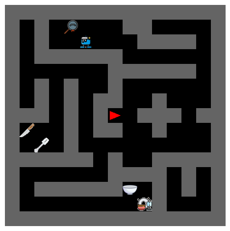

# Install
```
# pip install
pip install git+https://github.com/wcarvalho/JaxHouseMaze.git

# more manauly
conda create -n housemaze python=3.10 pip wheel -y
conda activate housemaze
pip install -r requirements.tx
# if want to run jupyter lab and plot things
pip install -U jupyterlab matplotlib
```

# JAX House Maze
This is a simple [JAX](https://github.com/google/jax) maze environment where you can easily describe maps with strings and an image dictionary. The map can either be symbolic, where each tile is represented by the category at that tile, or it can be visual, where images for tile-categories are load from a `image_data.pkl` file.

For example, the following string and dicionary:
``` python
maze = """
.#.C...##....
.#..D...####.
.######......
......######.
.#.#..#......
.#.#.##..#...
##.#.#>.###.#
A..#.##..#...
.B.#.........
#####.#..####
......####.#.
.######E.#.#.
........F#...
"""

char_to_key=dict(
    A="knife",
    B="fork",
    C="pan",
    D="pot",
    E="bowl",
    F="plates",
)
```

can render the following image:



Images for categories are loaded from a `image_data.pkl` file that needs to have the following two fields:
- `keys`
- `images`

Please see this [jupyter notebook](example.ipynb) for an interactive example loading the environment. One thing that's easy with this framework is loading in multiple mazes with different strings and then sampling between them when the environment resets. I give a simple example in the notebook.


**Benefits of jax environment**:
1. blazingly fast
2. can run many instances in parallel (e.g. 1000s of environments)
3. useful for things like meta-rl or unsupervised environment design


## Other projects using JAX
Here are some other libraries that also leverage Jax to obtain massive speedups in RL, which acted as inspiration for this codebase. In particularly, we heavily borrowed from [JaxUED](https://github.com/DramaCow/jaxued/) but mainly added a way to easily add object images to tiles and have multiple possible goals.

RL Algorithms in Jax
- [Minimax](https://github.com/facebookresearch/minimax): UED baselines, with support for multi-gpu training, and more parallel versions of PLR/ACCEL
- [PureJaxRL](https://github.com/luchris429/purejaxrl) End-to-end RL implementations in Jax
- [JaxIRL](https://github.com/FLAIROx/jaxirl): Inverse RL
- [Mava](https://github.com/instadeepai/Mava): Multi-Agent RL
- [JaxMARL](https://github.com/FLAIROx/JaxMARL): Lots of different multi-agent RL algorithms

RL Environments in Jax
- [Gymnax](https://github.com/RobertTLange/gymnax): Standard RL interface with several environments, such as classic control and MinAtar.
- [JaxMARL](https://github.com/FLAIROx/JaxMARL): Lots of different multi-agent RL environments
- [JaxUED](https://github.com/DramaCow/jaxued/): Unsupervised Environment Design Library.
- [Jumanji](https://github.com/instadeepai/jumanji): Combinatorial Optimisation
- [Pgx](https://github.com/sotetsuk/pgx): Board games, such as Chess and Go.
- [Brax](https://github.com/google/brax): Continuous Control (like Mujoco), in Jax
- [XLand-MiniGrid](https://github.com/corl-team/xland-minigrid): Meta RL environments, taking ideas from XLand and Minigrid
- [Craftax](https://github.com/MichaelTMatthews/Craftax): Greatly extended version of [Crafter](https://github.com/danijar/crafter) in Jax.
